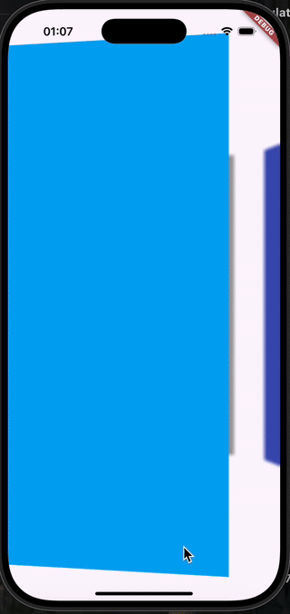
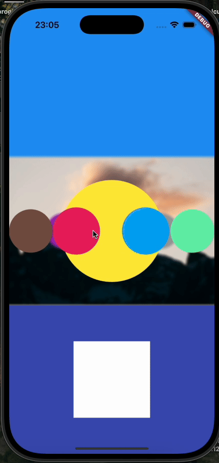
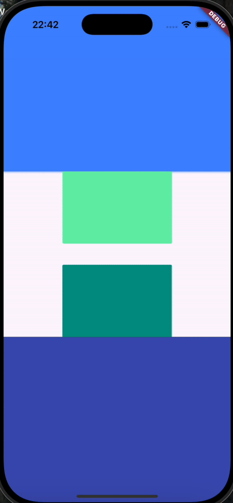

# flutter_3d_carousel

This is a 3d carousel animation project built in flutter. The 3D carousel responds to button clicks and swipes and can rotate infinitely.

It is implemented natively in flutter. No external dependencies are used.


## Example:

### Basic Example:

```dart
  @override
  Widget build(BuildContext context) {
    return CarouselWidget3D(
      radius: MediaQuery.sizeOf(context).width / 2,
      children: List.generate(6, (index) {
        return CarouselChild(
          child: Container(
            width: 300,
            height: 300,
            color: colors[index],
          ),
        );
      }),
    );
  }

  List<Color> colors = [
    Colors.lightBlue,
    Colors.greenAccent,
    Colors.indigo,
    Colors.grey,
    Colors.yellow,
    Colors.purple,
  ];
```


### Example 1

```dart
import 'package:flutter/material.dart';
import 'package:flutter_3d_carousel/flutter_3d_carousel.dart';

class Example1 extends StatelessWidget {
  const Example1({super.key});

  @override
  Widget build(BuildContext context) {
    return Scaffold(
      body: CarouselWidget3D(
        radius: MediaQuery.sizeOf(context).width,
        childScale: 0.9,
        dragEndBehavior: DragEndBehavior.snapToNearest,
        backgroundTapBehavior: BackgroundTapBehavior.startAndSnapToNearest,
        childTapBehavior: ChildTapBehavior.transparent,
        isDragInteractive: true,
        onlyRenderForeground: false,
        clockwise: false,
        backgroundBlur: 3,
        spinWhileRotating: true,
        shouldRotate: true,
        timeForFullRevolution: 20000,
        snapTimeInMillis: 100,
        perspectiveStrength: 0.001,
        dragSensitivity: 1.0,
        onValueChanged: (newValue) {
          print(newValue);
        },
        background: null,
        core: null,
        children: List.generate(
          colors.length,
              (index) => CarouselChild(
            child: Container(
              width: MediaQuery.sizeOf(context).width,
              height: MediaQuery.sizeOf(context).height,
              color: colors[index],
            ),
          ),
        ),
      ),
    );
  }
}

List<Color> colors = [
  Colors.lightBlue,
  Colors.greenAccent,
  Colors.indigo,
  Colors.grey,
  Colors.yellow,
  Colors.purple,
];

```

### Example 1 Screen Recording

 


### Example 2

```dart
import 'package:flutter/material.dart';
import 'package:flutter_3d_carousel/flutter_3d_carousel.dart';

class Example2 extends StatefulWidget {
  const Example2({super.key});

  @override
  State<Example2> createState() => _Example2State();
}

class _Example2State extends State<Example2> {
  Color? selectedColor;

  @override
  Widget build(BuildContext context) {
    return Scaffold(
      body: Column(
        children: [
          Expanded(child: Container(color: Colors.blue)),
          Expanded(
            child: CarouselWidget3D(
              radius: MediaQuery.sizeOf(context).width / 2,
              childScale: 0.7,
              dragEndBehavior: DragEndBehavior.snapToNearest,
              backgroundTapBehavior:
                  BackgroundTapBehavior.startAndSnapToNearest,
              childTapBehavior: ChildTapBehavior.stopAndSnapToChild,
              isDragInteractive: true,
              onlyRenderForeground: false,
              clockwise: false,
              backgroundBlur: 3,
              spinWhileRotating: false,
              shouldRotate: true,
              timeForFullRevolution: 12000,
              snapTimeInMillis: 100,
              perspectiveStrength: 0.001,
              dragSensitivity: 1.5,
              onValueChanged: (newValue) {
                // print(newValue);
              },
              background: Image.asset(
                'assets/images/background_1.jpg',
                fit: BoxFit.cover,
              ),
              core: Container(
                width: 200,
                height: 200,
                decoration: BoxDecoration(
                  shape: BoxShape.circle,
                  color: Colors.yellow,
                ),
              ),
              children: List.generate(colors.length, (index) {
                return CarouselChild(
                  child: Container(
                    width: MediaQuery.sizeOf(context).width / 3,
                    height: MediaQuery.sizeOf(context).height / 3,
                    decoration: BoxDecoration(
                      color: colors[index],
                      shape: BoxShape.circle,
                    ),
                  ),
                  onTap: () {
                    setState(() {
                      selectedColor = colors[index];
                    });
                  },
                );
              }),
            ),
          ),
          Expanded(
            child: Container(
              color: Colors.indigo,
              alignment: Alignment.center,
              child: Container(
                width: 150,
                height: 150,
                color: selectedColor ?? Colors.white,
              ),
            ),
          ),
        ],
      ),
    );
  }
}

List<Color> colors = [
  Colors.lightBlue,
  Colors.greenAccent,
  Colors.teal,
  Colors.grey,
  Colors.orangeAccent,
  Colors.purple,
  Colors.red,
  Colors.brown,
  Colors.pink,
];

```

### Example 2 Screen Recording

 


### Example 3

```dart
import 'package:flutter/material.dart';
import 'package:flutter_3d_carousel/flutter_3d_carousel.dart';

class Example3 extends StatelessWidget {
  const Example3({super.key});

  @override
  Widget build(BuildContext context) {
    return Scaffold(
      body: Column(
        children: [
          Expanded(child: Container(color: Colors.blueAccent)),
          Expanded(
            child: CarouselWidget3D(
              radius: MediaQuery.sizeOf(context).width * 0.6,
              onlyRenderForeground: true,
              spinWhileRotating: false,
              shouldRotate: true,
              spinAxis: Axis.vertical,
              timeForFullRevolution: 20000,
              perspectiveStrength: 0.002,
              dragSensitivity: 1.5,
              children: List.generate(colors.length, (index) {
                return CarouselChild(
                  child: Container(
                    width: MediaQuery.sizeOf(context).width * 3,
                    height: MediaQuery.sizeOf(context).width * 2,
                    decoration: BoxDecoration(
                      color: colors[index],
                      borderRadius: BorderRadius.circular(4),
                    ),
                  ),
                );
              }),
            ),
          ),
          Expanded(child: Container(color: Colors.indigo)),
        ],
      ),
    );
  }
}

List<Color> colors = [
  Colors.lightBlue,
  Colors.greenAccent,
  Colors.teal,
  Colors.orangeAccent,
  Colors.purple,
  Colors.red,
  Colors.brown,
  Colors.pink,
];

```

### Example 3 Screen Recording

 


## Ideas for features to add:

Ideas and feature requests are welcome. Here are some ideas for future updates:

- Add option to add only some of the children to the carousel. For example, 100 children, show 12.


## Contributing
Contributions from anyone are welcome. To contribute to the project, please follow these steps:
- Fork the repository.
- Create a new branch for your feature or bugfix.
- Make your changes and commit them.
- Push your changes to your forked repository.
- Open a pull request against the main branch of this repository.

Please ensure that your code follows the project's coding standards and includes appropriate tests.
